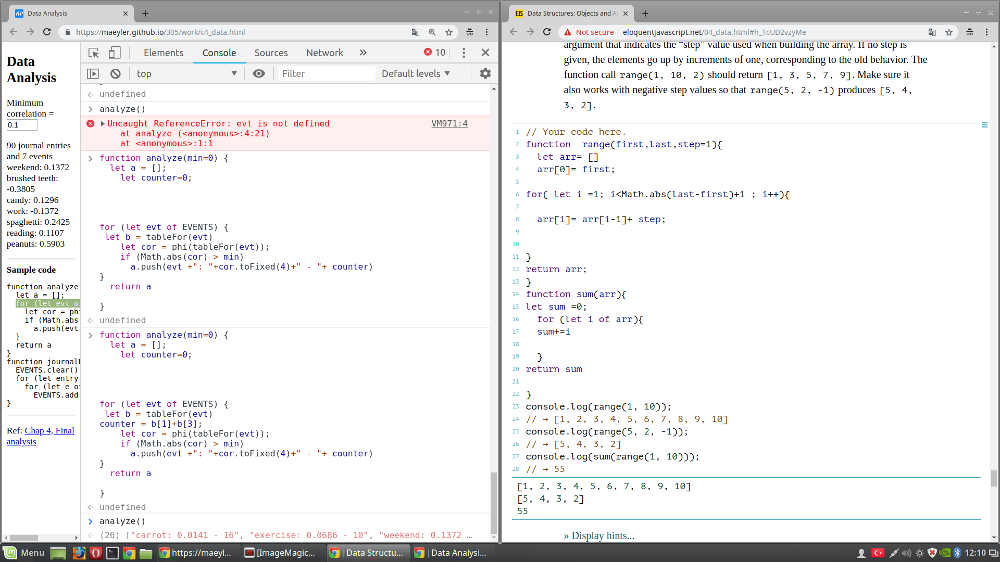

# JSOsman
For Lecture

[CW2-Counter](./Counter.html)

[CW2-Converting](./CelciusFahrenheitCalculator.html)

[CW1-Counting](./Counting.html)

[CW4-Courses Database](./CW4.html)

[CW6 File Checking](./CW6.html)

[CW7 Time Comparison](./CW7.html)
